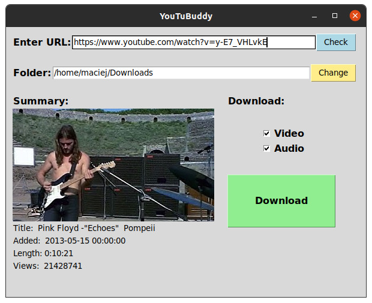

# YouTuBuddy
Download video and/or audio from YouTube url. Media are downloaded in best possible quality. Formats: video - mp4, audio - mp3.
## Technologies


## Preview

## Installation
### Linux:
0. Before<br>
Make sure you have python3 and GIT installed.
1. Clone repository
```bash
git clone https://github.com/ulaszewskim/YouTuBuddy.git
```
2. Create environment
```bash
cd YouTuBuddy
mkdir venv
python3 -m venv venv/
```
3. Install requirements
```
source venv/bin/activate
pip install -r requirements.txt
```
4. Install tkinter
```bash
sudo apt-get install python3-tk
```
5. Run
```bash
python3 buddy_gui.py
```
### Windows:
0. Before<br>
Make sure you have python3 and GIT installed.
1. Clone repository
```bash
git clone https://github.com/ulaszewskim/YouTuBuddy.git
```
2. Create environment
```bash
cd YouTuBuddy
mkdir venv
python3 -m venv venv/
```
3. Install requirements
```
venv\Scripts\activate.bat
pip install -r requirements.txt
```
4. Run **YouTuBuddy_Windows.bat**
